# IO notatki
## TOC
  * [TOC](#io-notatki)
  * [Pojęcia](#pojęcia)
  * [Wytwarzanie oprogramowania](#wytwarzanie-oprogramowania)
    * [Modele](#modele)
      * [Kaskadowy](#kaskadowy)
      * [V](#v)
      * [Spiralny](#spiralny)
      * [Ewolucyjny](#ewolucyjny)
      * [Iteracyjny](#iteracyjny)
  * [UML](#uml)
    * [Przykłady](#uml-przykłady)
      * [Klas](#klas)
      * [Obiektów](#obiektów)
      * [Przypadków użycia](#przypadków-użycia)
      * [Komponentów](#komponentów)
      * [Czynności](czynności-aktywności)
      * [*RESZTA*](#reszta)
  * [Agile](#agile)
    * [XP](#xp)
    * [SCRUM](#scrum)
    * [DSDM Atern](#dsdm-atern)
    * [AUP](#aup-agile-unified-process)
    * [KANBAN](#kanban)
  * [Wymagania](#wymagania)
  * [Wzorce projektowe](#wzorce-projektowe)
  * [SOLID](#solid)
  * [Standardy jakości](#standardy-jakości)
    * [CCM](#ccm-capability-maturity-model)
    * [ISO 9000](#iso-9000)
  * [Przykre zapachy w kodzie](#przykre-zapachy-w-kodzie)
  * [Testowanie](#testowanie)
  * [Oprogramowanie w chmurze](#oprogramowanie-w-chmurze)

## Pojęcia

Syndrom LOOP - Late, Over budget, Overtime, Poor quality 

## Wytwarzanie oprogramowania

Fundamentalne działania (wspólne dla wszystkich metod):
  1. **Specyfikowanie** (definiowanie wymagania, funkcjonalność, ograniczenia)
  2. **Tworzenie**
  3. **Walidacja** (testowanie, prezentacja klientowi)
  4. **Ewolucja** (dodawanie nowych funkcjonalności)

Cykl życia systemu
  1. studium zastosowalności
  2. analiza i specyfikacja
  3. projektowanie i tworzenie
  4. wdrażanie
  5. pielęgnacja
  6. aspekty usprawnienia

### Modele
#### Kaskadowy

Polega on na wykonywaniu podstawowych czynności jako odrębnych faz projektowych,
kolejno po sobie. Każda czynność to schodek:
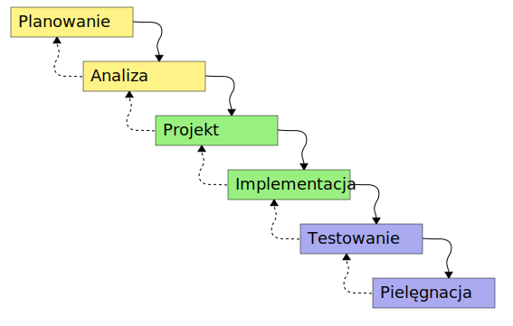

Jeśli któraś z faz zwróci niesatysfakcjonujący produkt cofamy się wykonując kolejne iteracje aż do momentu kiedy otrzymamy satysfakcjonujący produkt na końcu schodków.

Istotne cechy modelu:
  * nieelastyczny podział na kolejne rozłączne iteracyjne fazy
  * przejście do następnej fazy możliwe po zakończeniu poprzedniej
  * wysoki koszt iteracji przez powtarzanie wielu czynności

#### V

Sekwencyjny model, najczęściej posiadający cztery poziomy testowania odpowiadające
czterem poziomom rozwoju oprogramowania:

|                     |    Testy     |
|---------------------|--------------|
| wymagania klienta   | akceptacyjne |
| wymagania systemowe | systemowe    |
| ogólny design       | integracyjne |
| szczegółowy design  | modułowe     |

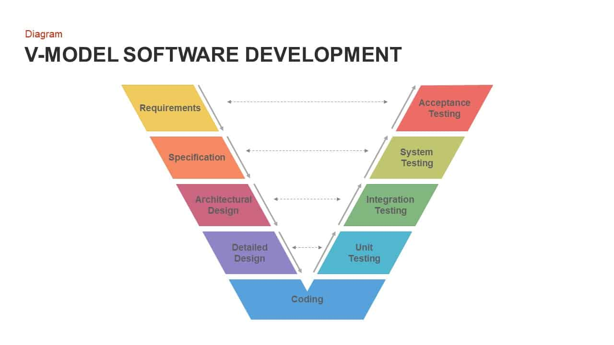

#### Spiralny

Każda pętla spirali podzielona jest na cztery sektory:
  * **Ustalanie celów** – definiowanie konkretnych celów wymaganych w tej fazie przedsięwzięcia. Identyfikacja ograniczeń i zagrożeń. Ustalanie planów realizacji.
  * **Rozpoznanie i redukcja zagrożeń** – przeprowadzenie szczegółowej analizy rozpoznanych zagrożeń, ich źródeł i sposobów zapobiegania. Podejmuje się odpowiednie kroki zapobiegawcze.
  * **Tworzenie i zatwierdzanie** – tworzenie oprogramowania w oparciu o najbardziej odpowiedni model, wybrany na podstawie oceny zagrożeń.
  * **Ocena i planowanie** – recenzja postępu prac i planowanie kolejnej fazy przedsięwzięcia bądź zakończenie procesu produkcyjnego.

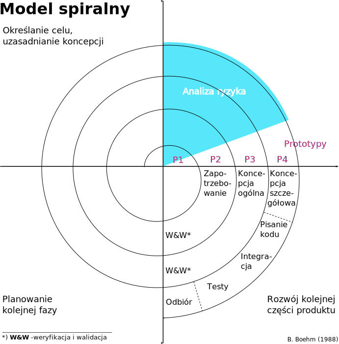

#### Ewolucyjny

#### Iteracyjny

## UML
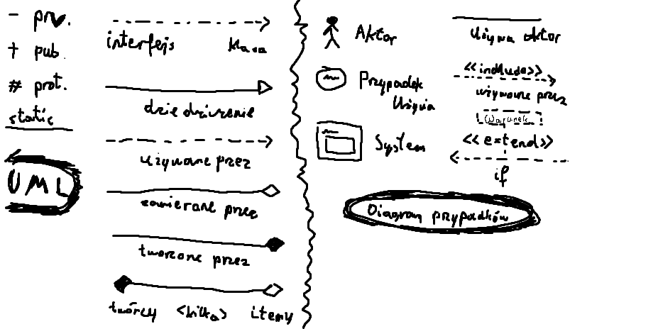
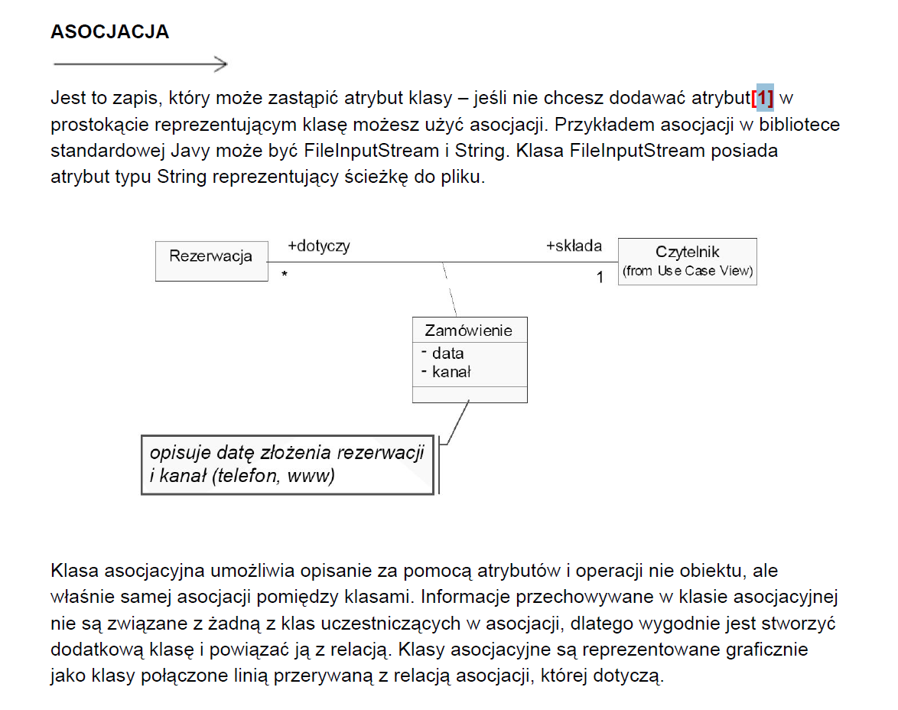
## UML (przykłady)
### Klas

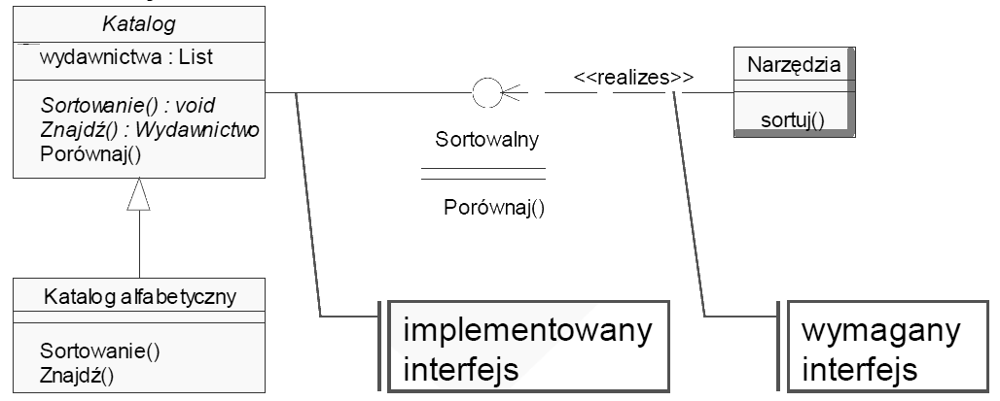
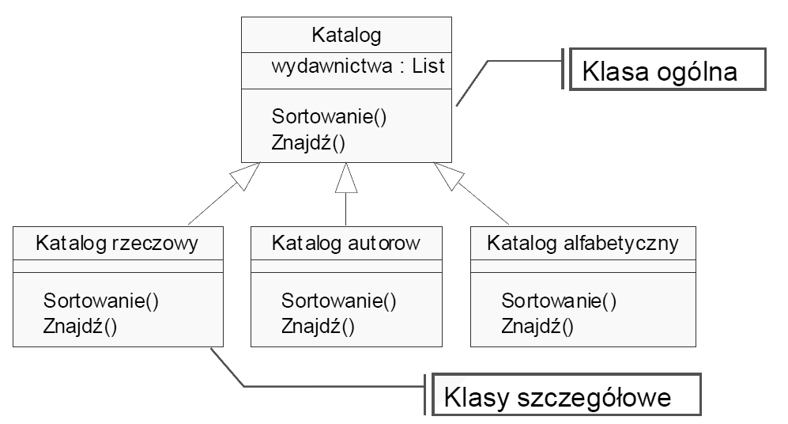
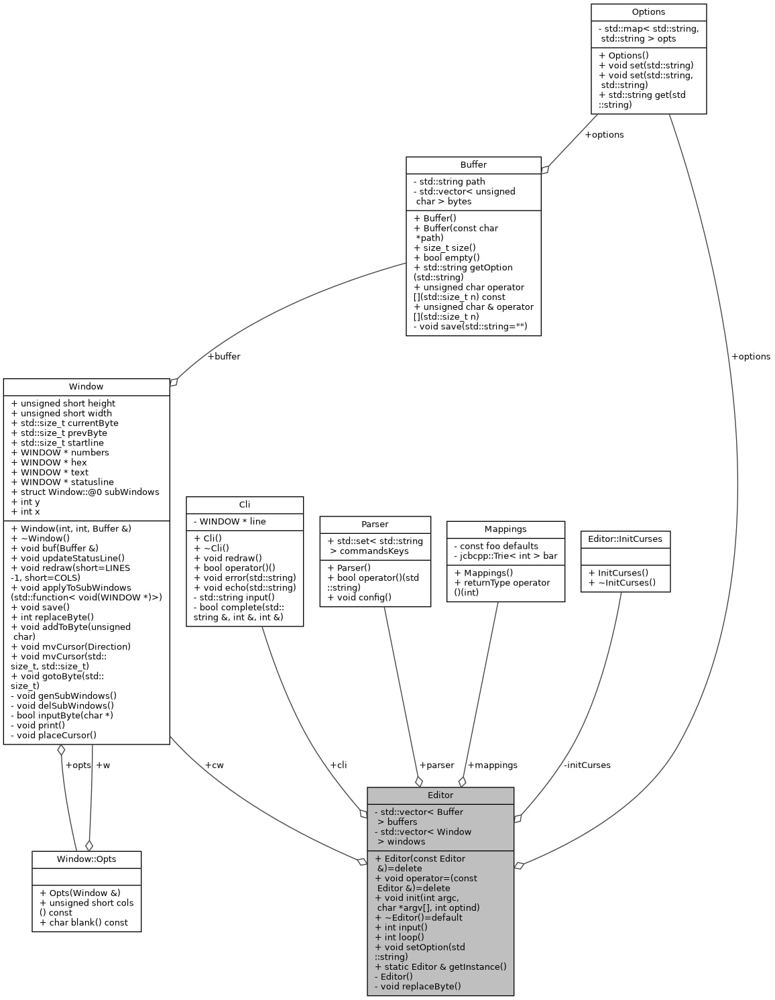

### Obiektów

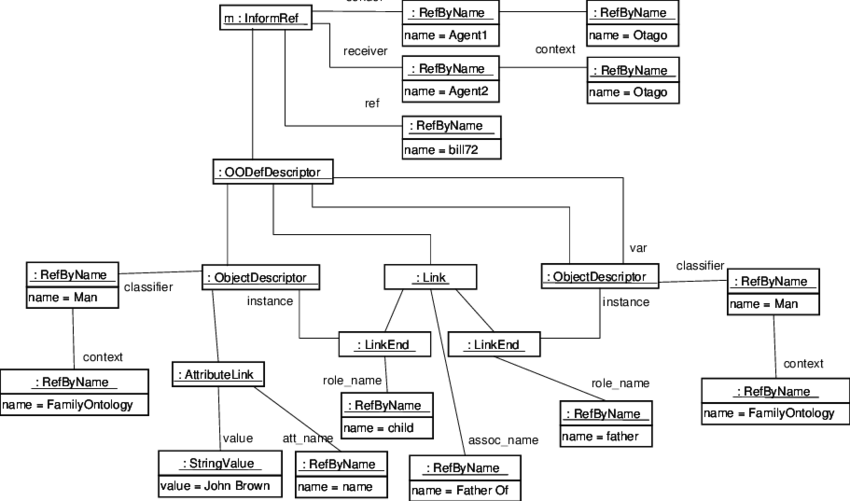

### Przypadków użycia

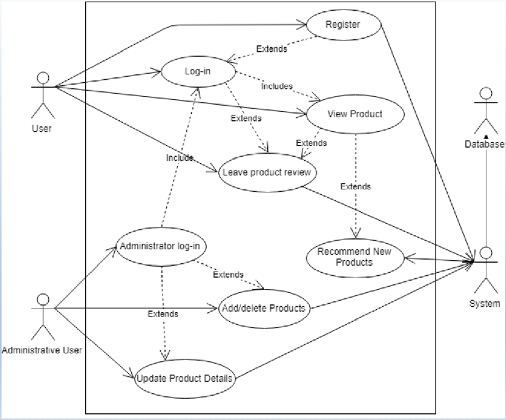
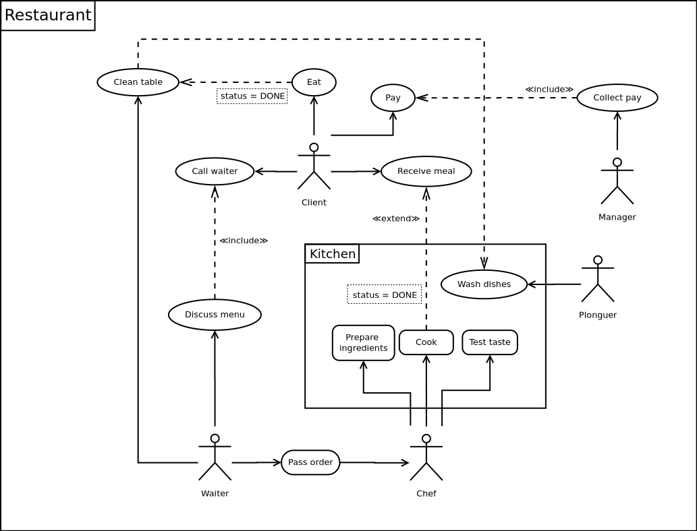

### Sekwencji

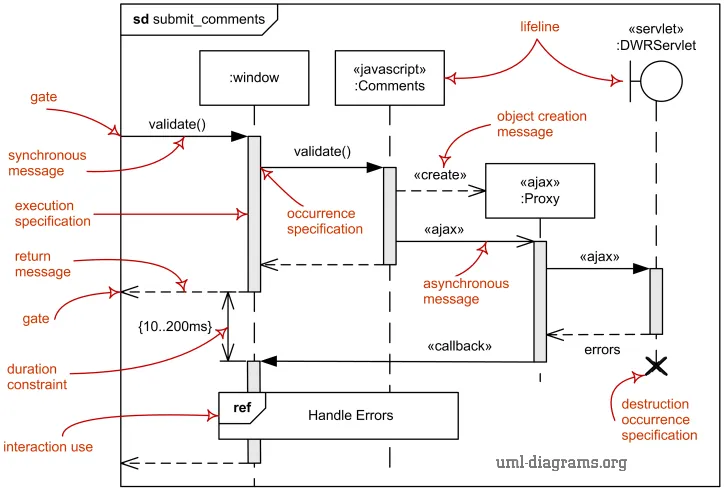

### Komponentów

### Czynności (aktywności)

### *RESZTA*

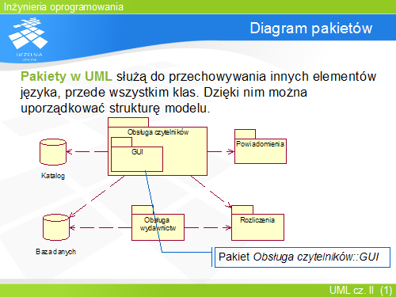
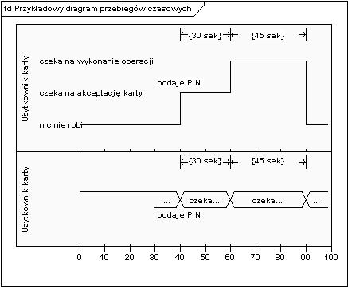
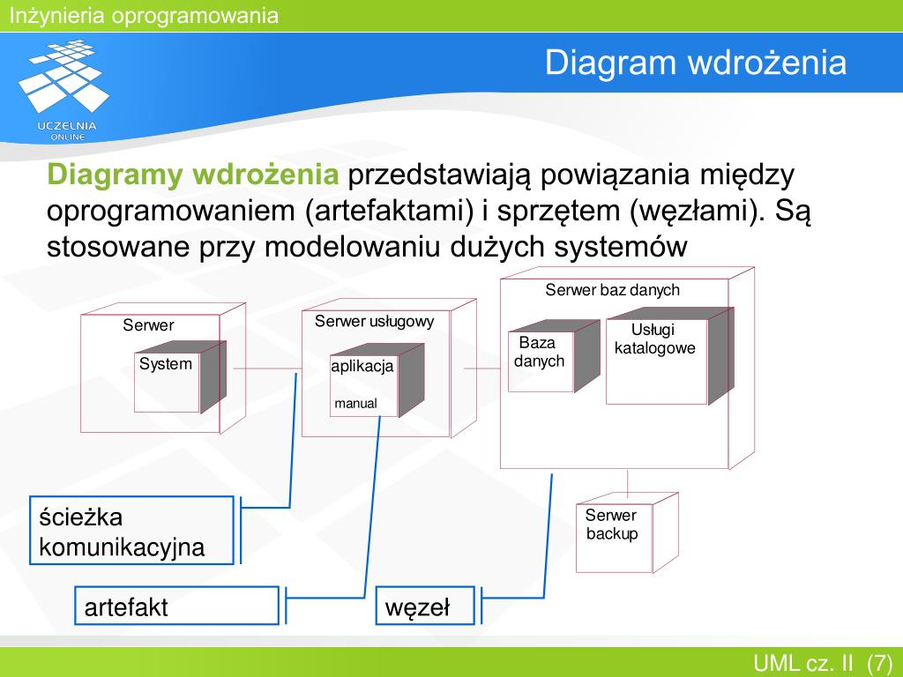
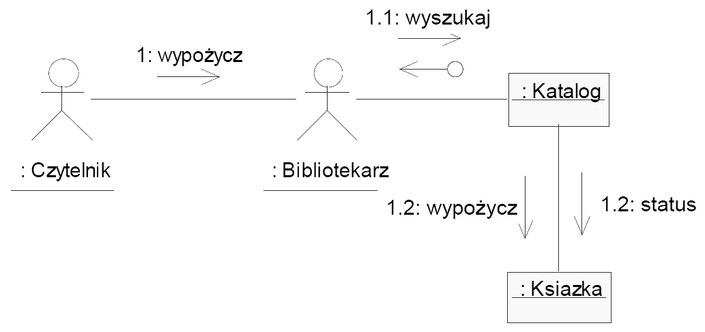
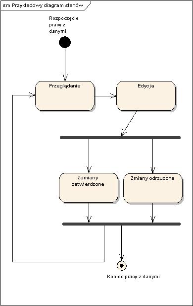

## Agile
### XP

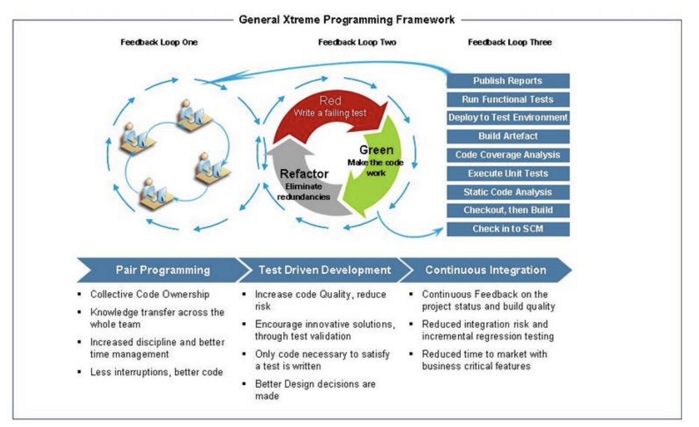

### SCRUM

### DSDM Atern

  * Principles:
    * Focus on the business need
    * Deliver on time
    * Collaborate
    * Never compromise quality
    * Build incrementally from firm foundations
    * Develop iteratively
    * Communicate continuously and clearly
    * Demonstrate control
  * Fazy:
    * *Pre-project*
      * problem biznesowy; identyfikacja Business Sponsor i Business Analysis,
      * zakres, plan i zasoby na fazę Feasibility.
    * *Feasibility*
      * ustalić wykonalność rozwiązania problemu biznesowego,
      * identyfikacja potencjalnych zysków; zarys możliwych podejść do rozwiązania,
      * pierwsze estymaty czasowe i kosztowe.
    * *Foundation*
      * wysoko poziomowe wymagania,
      * identyfikacja wspieranych procesów biznesowych,
      * podstawy architektury systemu; sposób zapewnienia wysokiej jakości.
    * *Exploration*
      * uszczegóławianie wymagań; iteracyjnie działające rozwiązanie,
      * zarys możliwych podejść do rozwiązania.
    * *Deployment*
      * potwierdzenie wydajności rozwiązania,
      * dostarczenie (iteracyjnie) rozwiązania,
      * dostarczenie potrzebnej dokumentacji
  * Role:
  * Techniki:
    * Timeboxing – umiejętne rozdzielenie realizacji produktu na nieprzekraczalne czasowo zakresu czasu
    * MoSCoW (must/should/could/won’t have)
    * Modelowanie
    * Prototypowanie
    * Warsztaty Facylitowane
    * Codzienne Zbiórki
    * Rozwój Iteracyjny

### KANBAN

Najkrócej ideę kanban oddaje hasło "7 x żadnych":
  * żadnych braków,
  * żadnych opóźnień,
  * żadnych zapasów,
  * żadnych kolejek (gdziekolwiek i po cokolwiek),
  * żadnych bezczynności,
  * żadnych zbędnych operacji technologicznych i kontrolnych,
  * żadnych przemieszczeń.

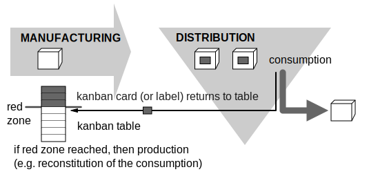

Reguły:
  * odbiorca przetwarza dokładnie tyle elementów, ile opisane jest na karcie kanban
  * dostawca wytwarza dokładnie tyle elementów, ile opisane jest na karcie kanban
  * żaden element nie jest wytwarzany lub przekazywany pomiędzy stanowiskami bez karty kanban
  * karta kanban musi towarzyszyć każdemu elementowi czy półproduktowi przetwarzanemu w ramachsystemu
  * elementy wadliwe lub występujące w niewłaściwych ilościach, nigdy nie są przekazywane w dółprocesu
  * limity obowiązujące na każdym z etapów (fizyczna ilość kart kanban) są stopniowo obniżane abyredukować zapasy i odkrywać nieefektywności procesów produkcji, dążąc do ich doskonalenia

## Wymagania

Wymagania to opis funkcji/usług i ograniczeń dla systemu; nie opisują jak system ma działać, ale co ma wykonywać.

**Wymagania funkcjonalne** - wymagania funkcjonalne to konkretne aspekty funkcjonalności aplikacji,
          które definiują działania, które mogą być udostępniane dla użytkownika czy samego oprogramowania.
          Odpowiadają na pytanie CO system ma robić.

**Wymagania niefunkcjonalne programu** - Wymagania niefunkcjonalne dotyczą tego JAK system powinien realizować swoje zadania,
          np. wymagania dotyczące koniecznych zasobów, ograniczeń czasowych, niezawodności, bezpieczeństwa,
          przenośności, współpracy z określonymi narzędziami i środowiskami, zgodności z normami i standardami,
          a także przepisami prawnymi, w tym dotyczącymi tajności i prywatności.

## Wzorce projektowe

Z *Bandy Czterech*:
  * konstrukcyjne
    * **Builder** - Oddziela tworzenie złożonego obiektu od jego reprezentacji, dzięki czemu ten sam proces konstrukcji może prowadzić do powstawania różnych reprezentacji.
    * **Abstract Factory** - Udostępnia interfejs do tworzenia rodzin powiązanych ze sobą lub zależnych od siebie obiektów bez określania ich klas konkretnych.
    * **Factory Method** - Określa interfejs do tworzenia obiektów, przy czym umożliwia podklasom wyznaczenie klasy danego obiektu. Metoda wytwórcza umożliwia klasom przekazanie procesu tworzenia egzemplarzy podklasom.
    * **Prototype** - Określa na postawie prototypowego egzemplarza rodzaje tworzonych obiektów i generuje nowe obiekty przez kopiowanie tego prototypu.
    * **Singleton** - Gwarantuje, że klasa będzie miała tylko jeden egzemplarz, i zapewnia globalny dostęp do niego.
  * strukturalne
    * **Adapter** - Przekształca interfejs klasy na inny, oczekiwany przez klienta.  Adapter umożliwia współdziałanie klasom, które z uwagi na niezgodne interfejsy standardowo nie mogą współpracować ze sobą.
    * **Decorator** - Dynamicznie dołącza dodatkowe obowiązki do obiektu. Wzorzec ten udostępnia alternatywny elastyczny sposób tworzenia podklas o wzbogaconych funkcjach.
    * **Facade** - Udostępnia jednolity interfejs dla zbioru interfejsów z podsystemu.  Fasada określa interfejs wyższego poziomu ułatwiający korzystanie z podsystemów.
    * **Composite** - Składa obiekty w struktury drzewiaste odzwierciedlające hierarchię typu część-całość. Wzorzec ten umożliwia klientom traktowanie poszczególnych obiektów i ich złożeń w teki sam sposób.
    * **Bridge** - Oddziela abstrakcję od jej implementacji, dzięki czemu można modyfikować te dwa elementy niezależnie od siebie.
    * **Proxy** - Udostępnia zastępnik lub reprezentanta innego obiektu w celu kontrolowania dostępu do niego.
    * **Flyweight** - Wykorzystuje współdzielenie do wydajnej usługi dużej liczby małych obiektów.
  * operacyjne
    * **Interpreter** - Określa reprezentację gramatyki języka oraz interpreter, który wykorzystuje tę reprezentację do interpretowania zdań z danego języka.
    * **Iterator** - Zapewnia sekwencyjny dostęp do elementów obiektu złożonego bez ujawniania jego wewnętrznej reprezentacji.
    * **Chain of Responsibility** - Pozwala uniknąć nadawcy żądania wiązania go z odbiorcą, ponieważ umożliwia obsłużenie żądania więcej niż jednemu obiektowi.  Łączy w łańcuch obiekty odbiorcze i przekazuje między nimi żądanie do momentu obsłużenia go.
    * **Mediator** - Określa obiekt kapsułkujący informacje o interakcji między obiektami z danego zbioru. Wzorzec ten pomaga zapewnić luźne powiązanie, ponieważ zapobiega bezpośredniemu odwoływaniu się obiektów do siebie i umożliwia niezależne modyfikowanie interakcji między nimi.
    * **Template Method** - Określa szkielet algorytmu i pozostawia doprecyzowanie niektórych jego kroków podklasom. Umożliwia modyfikację niektórych etapów algorytmu w podklasach bez zmiany jego struktury.
    * **Observer** - Określa zależność „jeden do wielu” między obiektami. Kiedy zmieni się stan jednego z obiektów, wszystkie obiekty zależne od niego są o tym automatycznie powiadamiane i aktualizowane.
    * **Visitor** - Reprezentuje operację wykonywaną na elementach struktury obiektowej. Wzorzec ten umożliwia zdefiniowanie nowej operacji bez zmieniania klas elementów, na których działa.
    * **Memento** - Bez naruszania kapsułkowania rejestruje i zapisuje w zewnętrznej jednostce wewnętrzny stan obiektu, co umożliwia późniejsze przywrócenie obiektu według zapisanego stanu.
    * **Command** - Kapsułkuje żądanie w formie obiektu. Umożliwia to parametryzację klienta przy użyciu różnych żądań oraz umieszczenia żądań w kolejkach i dziennikach, a także zapewnia obsługę cofania operacji.
    * **State** - Umożliwia obiektowi modyfikację zachowania w wyniku zmiany wewnętrznego stanu. Wygląda to tak, jakby zmienił klasę.
    * **Strategy** - Określa rodzinę algorytmów, kapsułkuje każdy z nich i umożliwia ich zamienne stosowanie. Wzorzec ten pozwala zmieniać algorytmy niezależnie od korzystających z nich klientów

## SOLID

The SOLID concepts are:
  * **Single-responsibility principle**: "There should never be more than one reason for a class to change." In other words, every class should have only one responsibility.
  * **Open-closed principle**: "Software entities (classes, modules, functions, etc.) should be open for extension, but closed for modification."
  * **Liskov substitution principle**: "Functions that use pointers or references to base classes must be able to use objects of derived classes without knowing it"
  * **Interface segregation principle**: "Many client-specific interfaces are better than one general-purpose interface."
  * **Dependency inversion principle**: "Depend upon abstractions, not concretions."

 

Materiały od Hryszka:
  * https://www.p-programowanie.pl/paradygmaty-programowania/zasady-solid
  * https://dzone.com/articles/the-5-solid-principles-explained
  * https://www.youtube.com/watch?v=HyQlCMU_Ylw

## Standardy jakości

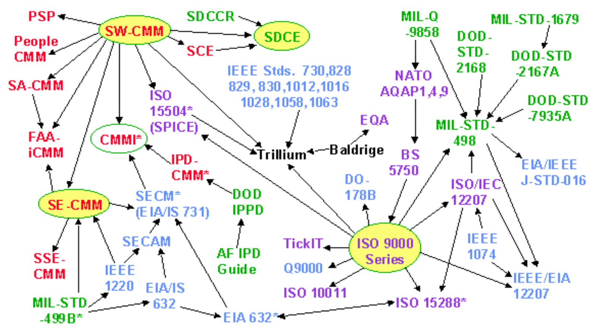

### CCM (Capability Maturity Model)

Ocenia proces wytwórczy służacy do produkcji oprogramowania w skali
pięciostopniowej - od chaotycznego (nic nie jest sterowane ani kontrolowane),
aż do ścisłego, zdyscyplinowanego procesu uwzględniającego wszystkie potrzebne
aspekty. Model CMM obejmuje pięć aspektów: *poziomy dojrzałości*, *kluczowe
obszary procesowe*, *cele*, *atrybuty procesu*, *kluczowe praktyki*.

Poziomy CCM:
  1. **Initial** – oprogramowanie tworzone chaotycznie, bez żadnych formalnych procedur, ewentualnie z takimi, które są szczątkowe – nie określają procesu.
  2. **Repeatable** – stosowane są podstawowe techniki śledzenia projektu – śledzi się koszt, harmonogram oraz funkcjonalność. Stosuje się techniki pozwalające na powtarzanie udanych projektów na podstawie informacji zapisanych przy okazji poprzednich.
  3. **Defined** – proces wytwórczy jest opisany, wszystkie wykonywane czynności są udokumentowane w postaci procedur lub instrukcji.
  4. **Managed** – podczas projektów stosuje się szczegółowe metryki dotyczące samego procesu, oraz jakości produktu.
  5. **Optimizing** – stosuje się praktyki mające na celu ciągłe poprawianie procesu wytwórczego oprogramowania – poprzez monitorowanie procesu pod względem możliwości usprawnień oraz poprzez ich wprowadzanie.

### ISO 9000

Wymaga, aby firma udokumentowała wszystkie swoje procedury związane z wytwarzaniem oprogramowania.

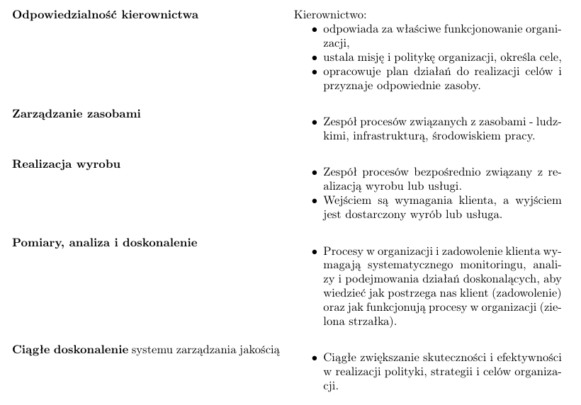
## Przykre zapachy w kodzie
  * **Zduplikowany kod**
  * **Długa metoda** - metoda wykonuje w rzeczywistości wiele czynności
  * **Nadmiernie rozbudowana klasa**
  * **Długa lista parametrów**
  * **Nadmiar komentarzy**
  * **Niekompletna klasa biblioteczna**
  * **Skomplikowane instrukcje warunkowe**
  * **Łańcuchy wywołań metod**
  * **Pojemnik na dane** - klasa jedynie przechowuje dane i nie posiada użytecznych metod
  * **Zbitka danych**
  * **Odrzucony spadek** - podklasa nie wykorzystuje odziedziczonych metod i pól
  * **Niewłaściwa hermetyzacja**
  * **Bezużyteczna klasa**
  * **Zazdrość o funkcję** - metoda w klasie częściej korzysta z metod w obcych klasach
  * **Równoległe hierarchie dziedziczenia** - utworzenie podklasy powoduje konieczność utworzenia odpowiadającej jej podklasy w innej hierarchii dziedziczenia
  * **Pośrednik** - klasa deleguje większość funkcjonalności do innych klas
  * **Zmiany z wielu przyczyn** - klasa jest wielokrotnie modyfikowana w różnych celach
  * **Odpryskowa modyfikacja** - zmiana w jednym miejscu powoduje konieczność modyfikacji w innych
  * **Spekulacyjne uogólnienie** - klasa jest zaprojektowana pod kątem potencjalnej funkcjonalności do zaimplementowania w przyszłości

## Testowanie

| Rodzaj testów | Co testuje? |
|---------------|-------------|
| jednostkowe   | polegają na testowaniu poszczególnych metod i funkcji klas, komponentów lub modułów |
| integracyjne  | sprawdzają, czy różne moduły lub usługi wykorzystywane przez oprogramowanie dobrze ze sobą współpracują |
| systemowe     | sprawdzają funkcjonalne oraz niefunkcjonalne wymagania syste-mowe oraz jakość testowanych danych |
| akceptacyjne  | formalne testy sprawdzające spełnienie wymagań biznesowych |
| regresyjne    | ponowne przetestowanie uprzednio testowanego programu po dokonaniu w nim modyfikacji lub zmianie środowiska pracy |

*Smoke test* - przetestowanie sprzętu pod kątem tak oczywistego problemu,
że wydobywający się z urządzenia dym byłby przewidywanym kryterium niezaliczenia testu:
  * **test pobieżny** (będzie to często test przeszukujący "wszerz", a nie "wgłąb"; często będzie to test najbardziej typowej ścieżki czynności, którą może przebyć potencjalny użytkownik)
  * **test zajmujący** niewiele czasu (ma szybko udzielić informacji koniecznych do podjęcia decyzji, co zrobimy dalej w ramach testowania)
  * **test poszukujący** bardzo wyraźnych problemów (test zdany pomyślnie powinien wykluczyć zachodzenie ewidentnej awarii na swojej ścieżce)
  * **test dopuszczający** do kolejnego etapu prac (zwłaszcza w kontekście zaangażowania w tym kolejnym etapie znaczących zasobów)

## Oprogramowanie w chmurze
  * **SaaS** (*Software as a Service*) - aplikacja jest przechowywana i wykonywana na komputerach dostawcy usługi i jest udostępniana użytkownikom przez Internet.
  * **IaaS** (*Infrastracture as a Service*) - polega na dostarczeniu przez dostawcę całej infrastruktury informatycznej, takiej jak np. wirtualizowany sprzęt, skalowany w zależności od potrzeb użytkownika.
  * **PaaS** (*Platform as a Service*) - polega na udostępnieniu przez dostawcę wirtualnego środowiska pracy; skierowana jest przede wszystkim do programistów.
